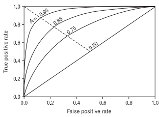

# Evaluation Metrics for Classification
{: .text-center}
분류 평가지표

## Confusion matrix

**sklearn.metrics.plot_confusion_matrix**

**분류기**의 정확한 성능을 판단하기 위해서는 **정확도 외에 다른 평가지표**를 같이 사용해야 한다.  

* 정확도(Accuracy)는 전체 범주를 모두 바르게 맞춘 경우를 전체 수로 나눈 값입니다: $\large \frac{TP + TN}{Total}$
* 정밀도(Precision)는 Positive로 예측한 경우 중 올바르게 Positive를 맞춘 비율입니다: $\large \frac{TP}{TP + FP}$
* 재현율(Recall, Sensitivity)은 실제 Positive인 것 중 올바르게 Positive를 맞춘 것의 비율 입니다: $\large \frac{TP}{TP + FN}$
* F1점수(F1 score)는 정밀도와 재현율의 조화평균(harmonic mean)입니다: $ 2\cdot\large\frac{precision\cdot recall}{precision + recall}$

**다루는 문제에 따라 정밀도와 재현율 중 어느 평가지표를 우선시 해야하는지 판단**

 

**임계값 (threshold)**

## ROC, AUC (Receiver Operating Characteristic, Area Under the Curve)

+ 모든 임계값을 한눈에 보고 평가 할 수 있는 방법
+ 재현율을 높이기 위해서는 Positive로 판단하는 임계값을 계속 낮추어 모두 Positive로 판단하게 만들면 된다. 하지만 이렇게 하면 동시에 Negative이지만 Positive로 판단하는 위양성률도 같이 높아진다.
+ 재현율은 최대화 하고 위양성률은 최소화 하는 임계값이 최적의 임계값이다..
+ AUC 는 ROC curve의 아래 면적을 말한다.

- TPR : True Positive Rate (=민감도, true accept rate)
1인 케이스에 대해 1로 잘 예측한 비율.(암환자를 진찰해서 암이라고 진단 함)

- FPR :  False Positive Rate (=1-특이도, false accept rate)
0인 케이스에 대해 1로 잘못 예측한 비율.(암환자가 아닌데 암이라고 진단 함)

> ROC 거브는 두가지 장점이 있다.
> 1. 그 커브의 면적을 재어 다양한 기준에서의 TRP와 FPR을 복합적으로 평가 할 수 있다.
> 2. 실제로 병을 판단할 때 어디를 기준으로 잡을지 결정 할 수 있다. (병에 따라서)

