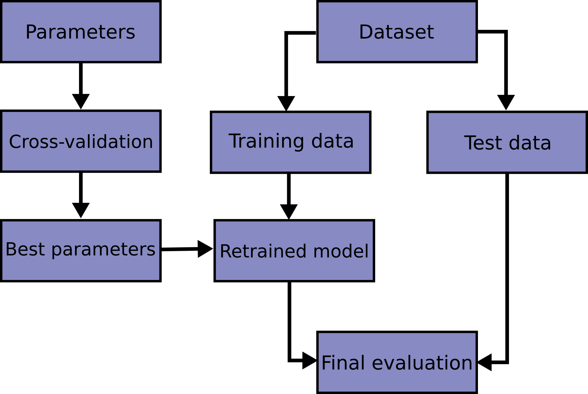

## Model Selection (모델 선택)

### 교차검증(Cross-validation)

**hold-out 교차검증** 은 **훈련/검증/테스트 세트**로 나누어 학습을 진행  
*문제점*
+ 훈련세트의 크기가 모델학습에 충분하지 않을 때 문제가 될 수 있음
+ 검증세트의 크기가 충분히 크기 않다면 예측 성능에 대한 추정이 부정확 할것

이런한 문제점을 해결하기 위한 방법중 하나가 **교차검증**

**교차검증은 시계열 데이터에는 적합하지 않다.**

---

### 교차검증의 사용

교차검증을 하기 위해서는 데이터를 k개로 등분하여야 하는데 이를 k-fold cross-validation(CV)  
k개의 집합에서 k-1 개의 부분집합을 훈련에 사용하고 나머지 부분집합을 테스트 데이터로 검증

> **TargetEncoder** : 범주형 변수를 숫자로 바꿀때 타겟값의 평균을 사용하는 인코더 

---

## 하이퍼파라미터 튜닝

**사이킷런을 사용하여 하이퍼파라미터를 최적화 할 수 있다.**

+ **최적화**는 훈련 데이터로 더 좋은 성능을 얻기 위해 모델을 조정하는 과정이며,
+ **일반화**는 학습된 모델이 처음 본 데이터에서 얼마나 좋은 성능을 내는지를 이야기 한다.

+ **과소적합** : 모델의 복잡도를 높이는 과정에서 훈련/검증 세트의 손실이 함께 감소하는 시점
+ **과대적합** : 어느 시점부터 훈련데이터의 손실은 계속 감소하는데 검증데이터의 손실은 증가하는 때

---

## Randomized Search CV

사이킷런의 도구
+ GridSearchCV : 검증하고 싶은 하이퍼파라미터들의 수치를 정해주고 그 조합을 모두 검증.
+ RandomizedSearchCV : 검증하려는 하이퍼파라미터들의 값 범위를 지정해주면 무작위로 값을 지정해 그 범위를 검증.


### Ridge 회귀모델의 하이퍼파라미터를 튜닝

```python
from sklearn.model_selection import RandomizedSearchCV

pipe = make_pipeline(
    OneHotEncoder(use_cat_names=True)
    , SimpleImputer()
    , StandardScaler()
    , SelectKBest(f_regression)
    , Ridge()
)

# 튜닝할 하이퍼파라미터의 범위를 지정해 주는 부분
dists = {
    'simpleimputer__strategy': ['mean', 'median'], 
    'selectkbest__k': range(1, len(X_train.columns)+1), 
    'ridge__alpha': [0.1, 1, 10], 
}

clf = RandomizedSearchCV(
    pipe, 
    param_distributions=dists, 
    n_iter=50, 
    cv=3,
    scoring='neg_mean_absolute_error',
    verbose=1,
    n_jobs=-1
)

clf.fit(X_train, y_train);
```

```python
print('최적 하이퍼파라미터: ', clf.best_params_)
print('MAE: ', -clf.best_score_)
```

RandomSearchCV는 n_iter(=50) * 3 교차검증 = 150 tasks를 수행  
하지만 GridSearchCV를 사용해 이 범위를 검색하려면 얼마나 많은 태스크가 필요할까요?  
+ 2 imputation n cols 3 alphas * 3 cv

```python 
2 * len(X_train.columns) * 3 * 3
```

### 랜덤포레스트에 하이퍼파라미터를 튜닝
```python
from scipy.stats import randint, uniform

pipe = make_pipeline(
    TargetEncoder(), 
    SimpleImputer(), 
    RandomForestRegressor(random_state=2)
)

dists = {
    'targetencoder__smoothing': [2.,20.,50.,60.,100.,500.,1000.], # int로 넣으면 error(bug)
    'targetencoder__min_samples_leaf': randint(1, 10),     
    'simpleimputer__strategy': ['mean', 'median'], 
    'randomforestregressor__n_estimators': randint(50, 500), 
    'randomforestregressor__max_depth': [5, 10, 15, 20, None], 
    'randomforestregressor__max_features': uniform(0, 1) # max_features
}

clf = RandomizedSearchCV(
    pipe, 
    param_distributions=dists, 
    n_iter=50, 
    cv=3, 
    scoring='neg_mean_absolute_error',  
    verbose=1,
    n_jobs=-1
)

clf.fit(X_train, y_train);
```

```python
print('최적 하이퍼파라미터: ', clf.best_params_)
print('MAE: ', -clf.best_score_)
```



-----

선형회귀, 랜덤포레스트 모델들의 튜닝 추천 하이퍼파라미터
{: .label .label-green }
**Random Forest**
+ class_weight (불균형(imbalanced) 클래스인 경우)
+ max_depth (너무 깊어지면 과적합)
+ n_estimators (적을경우 과소적합, 높을경우 긴 학습시간)
+ min_samples_leaf (과적합일경우 높임)
+ max_features (줄일 수록 다양한 트리생성)  
{: .bg-grey-lt-200}

**Logistic Regression**
+ C (Inverse of regularization strength)
+ class_weight (불균형 클래스인 경우)
+ penalty  
{: .bg-grey-lt-200}

**Ridge / Lasso Regression**
+ alpha
{: .bg-grey-lt-200}


