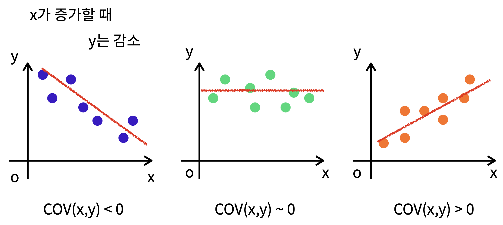

# linear algebra (선형대수) 2

## Variance (분산)

+ 분산은 데이터가 **얼마나 퍼져있는지** 측정하는 방법.  
+ 각 값들의 평균으로부터 차이의 제곱의 평균

**분산 계산시의 자유도** (ddof)
+ 샘플의 분산 : n-1
+ 모집단의 분산 : 0
  
## Standard Deviation (표준편차)

표준편차는 분산의 값에 루트를 씌운것  $\sqrt()$  

## Covariance (공분산)

1개의 변수의 값이 변화할 때 다른 변수가 어떠한 **연관성을 나타내며 변화하는지**를 측정하는 것.



문제점 : X와 Y의 **크기에 영향**을 받는다.

```pyghon
df.cov()
```

## Correlation coefficient (상관계수)

+ 공분산을 두 변수의 표준편차로 각각 나눠주면 스케일을 조정 할 수 있으며 상관계수라고 부름.
+ -1 에서 1까지의 값을 가지며 0에 가까울 수록 선형연관성이 없음
+ 데이터의 평균 혹은 분산의 크기에 영향을 받지 않는다.

```python
df.corr()
```

##  Spearman correlation

## Orthogonality (직교)

수직(직교)인 벡터는 상관관계가 없다.  
임의의 두 벡터의 내적값이 0이면 서로 수직이다.

## 단위 벡터 (Unit Vectors)

선형대수에서, 단위 벡터란 길이가 1인 벡터.  
모든 벡터는 단위 벡터의 선형 조합으로 표기된다.

## Span

주어진 벡터의 조합으로 만들어 낼 수 있는 가능한 모든 벡터의 집합  

+ 선형 관계의 벡터
+ 선형관계가 없는 벡터
  
## Basis (기저 벡터)

**특정한 Vector Space를 Span(구성)해주는 선형 결합 벡터들의 최소 개수이다**  

### Orthogonal Basis
### Orthonaormal Basis

## Rank

메트릭스의 Rank란, 메트릭스의 열을 이루고 있는 벡터들로 만들 수 있는 (span) 공간의 차원

> 특정 벡터공간을 구성(span)하는 선형독립 벡터들의 최소 개수인 Basis은 여러개이다.(not unique)  
> 
> 하지만 특정한 Basis안에서의 벡터들의 Linear Combination의 Scala값은 Unique하다!(즉, 선형결합이 Unique하다.)


